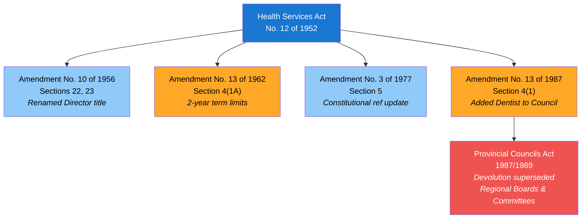
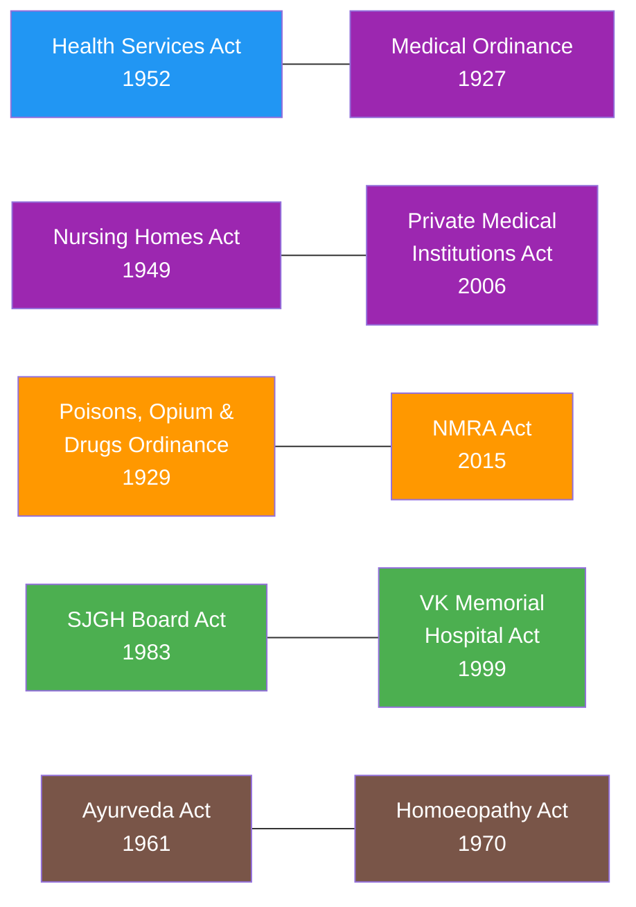
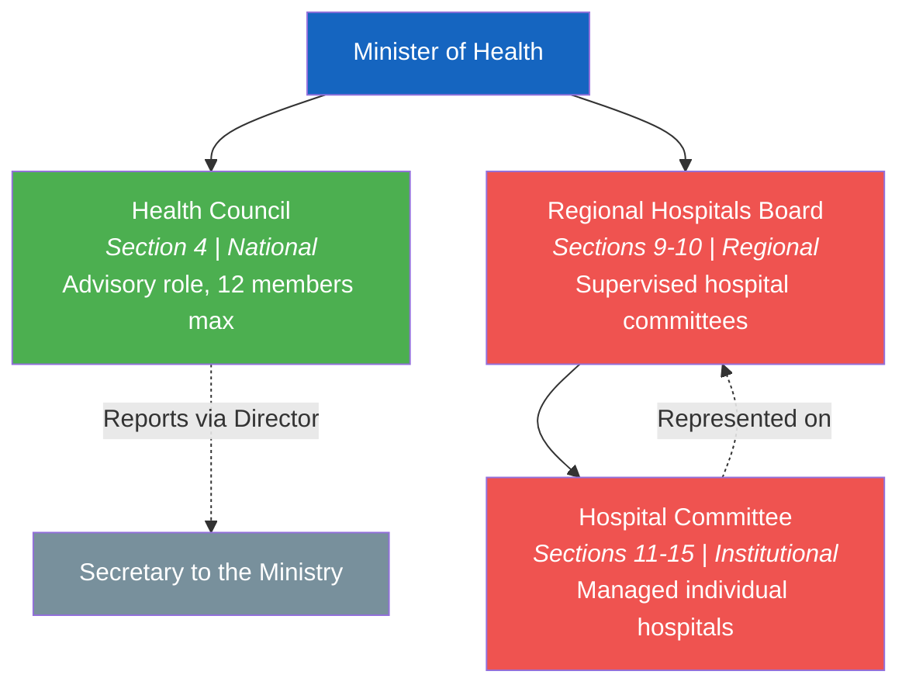

# Act Lineage & Relationships

Visual diagrams showing how the Health Services Act, No. 12 of 1952 evolved through amendments, how acts cross-reference each other, and how the original governance hierarchy was structured.

## Amendment Flowchart

The Health Services Act has been amended four times between 1956 and 1987. Two amendments were administrative (low impact), and two changed governance structure (medium impact).

**Legend:** Blue = low impact, Orange = medium impact, Red = external supersession

### Source Documents

| Act | Year | Source | Link |
|-----|------|--------|------|
| Health Services Act, No. 12 of 1952 | 1952 | LawNet (HTML) | [View original act](https://www.lawnet.gov.lk/wp-content/uploads/Legislative_html/1956Y8V219C.html) |
| Amendment No. 10 of 1956 | 1956 | LawNet (HTML, incorporated) | [View source](https://www.lawnet.gov.lk/wp-content/uploads/Legislative_html/1956Y8V219C.html) |
| Amendment No. 13 of 1962 | 1962 | CommonLII | [View source](https://www.commonlii.org/lk/legis/num_act/hsa13o1962287/) |
| Amendment No. 3 of 1977 | 1977 | Lanka Law (HTML) | [View source](https://lankalaw.net/wp-content/uploads/2025/02/1977Y0V0C3A.html) |
| Amendment No. 13 of 1987 | 1987 | Lanka Law (PDF) | [View PDF](https://lankalaw.net/wp-content/uploads/2024/02/3390.pdf) |

## Cross-Reference Network

Acts under the Health Ministry do not exist in isolation. Several acts reference or complement each other.

**Colors by domain:** Blue = Health Administration, Purple = Medical Regulation, Orange = Food & Drug Safety, Green = Hospital Management, Brown = Traditional Medicine

### Act Sources

| Act | Year | Source | Link |
|-----|------|--------|------|
| Health Services Act, No. 12 of 1952 | 1952 | LawNet (HTML) | [View source](https://www.lawnet.gov.lk/wp-content/uploads/Legislative_html/1956Y8V219C.html) |
| Medical Ordinance, No. 26 of 1927 | 1927 | SLMC (PDF) | [View PDF](http://www.au.slmc.gov.lk/wp-content/uploads/2023/02/Medical-Ordinance.pdf) |
| Nursing Homes Act, No. 16 of 1949 | 1949 | CommonLII (PDF) | [View PDF](http://www.commonlii.org/lk/legis/consol_act/nh551326.pdf) |
| Private Medical Institutions Act, No. 21 of 2006 | 2006 | PHSRC (PDF) | [View PDF](http://www.phsrc.lk/content/files/acts/ACT,No.21-2006_E.pdf) |
| Poisons, Opium & Drugs Ordinance, No. 17 of 1929 | 1929 | NDDCB (PDF) | [View PDF](https://www.nddcb.gov.lk/Docs/acts/25345.pdf) |
| NMRA Act, No. 5 of 2015 | 2015 | LawNet (HTML) | [View source](https://www.lawnet.gov.lk/wp-content/uploads/Law%20Site/4-stats_1956_2006/set6/2006Y0V0C5A.html) |
| SJGH Board Act, No. 54 of 1983 | 1983 | SriLankaLaw (PDF) | [View PDF](https://www.srilankalaw.lk/YearWisePdf/1983/SRI%20JAYEWARDENEPURA%20GENERAL%20HOSPITAL%20BOARD%20ACT,%20NO.%2054%20OF%201983.pdf) |
| VK Memorial Hospital Act, No. 38 of 1999 | 1999 | Gov.lk (PDF) | [View PDF](https://documents.gov.lk/view/acts/1999/11/38-1999_E.pdf) |
| Ayurveda Act, No. 31 of 1961 | 1961 | National Library (PDF) | [View PDF](https://diglib.natlib.lk/bitstream/handle/123456789/42201/255_CEYLON%20GOVERNMENT%20GAZETTE_1961-MAY-JUNE_AYURVEDA%20ACT_NO-31_02-06-1961_E.pdf?sequence=1&isAllowed=y) |
| Homoeopathy Act, No. 7 of 1970 | 1970 | Lanka Law (HTML) | [View source](https://lankalaw.net/wp-content/uploads/2025/02/1970Y0V0C7A.html) |

## Governance Hierarchy (Original 1952 Design)

The Health Services Act established a three-tier governance structure. The top tier (Health Council) remains legally active, while the lower two tiers were superseded by provincial devolution in 1989.

**Legend:** Green = legally active, Red = obsolete (superseded 1989), Gray = reporting target

## Entity-Relationship Diagram

This ER diagram shows the structural relationships between entities defined in the Health Services Act, modeled using OpenGIN-compatible entity types.

```mermaid
erDiagram
    HEALTH_SERVICES_ACT ||--o{ AMENDMENT : "amended by"
    HEALTH_SERVICES_ACT ||--|{ HEALTH_COUNCIL : "establishes"
    HEALTH_SERVICES_ACT ||--|{ REGIONAL_HOSPITALS_BOARD : "establishes"
    HEALTH_SERVICES_ACT ||--|{ HOSPITAL_COMMITTEE : "establishes"
    REGIONAL_HOSPITALS_BOARD ||--o{ HOSPITAL_COMMITTEE : "supervises"
    HEALTH_COUNCIL ||--o{ MEMBER_ROLE : "composed of"

    HEALTH_SERVICES_ACT {
        string id "health-services-act-12-1952"
        string kind_major "Legislation"
        string kind_minor "act"
        int year "1952"
        string status "active"
    }

    AMENDMENT {
        string id "amendment-id"
        int year "1956-1987"
        string type "Technical or Governance"
        string impactRating "low-medium"
    }

    HEALTH_COUNCIL {
        string id "health-council"
        string kind_major "Organisation"
        string kind_minor "statutory-body"
        string status "legally-active"
        int maxMembers "12"
    }

    REGIONAL_HOSPITALS_BOARD {
        string id "regional-hospitals-board"
        string kind_major "Organisation"
        string kind_minor "statutory-body"
        string status "obsolete"
    }

    HOSPITAL_COMMITTEE {
        string id "hospital-committee"
        string kind_major "Organisation"
        string kind_minor "statutory-body"
        string status "obsolete"
    }

    MEMBER_ROLE {
        string role "Director, Deputy Director, etc."
        string type "ex-officio or nominated"
        string term "2 years (nominated)"
    }
```

