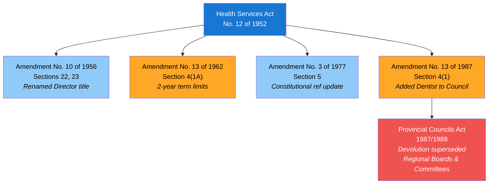
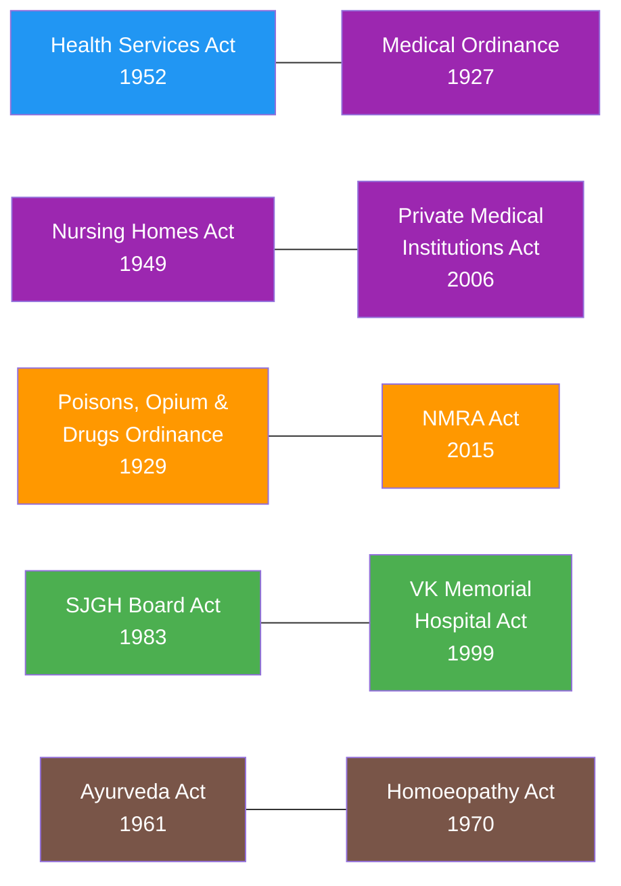
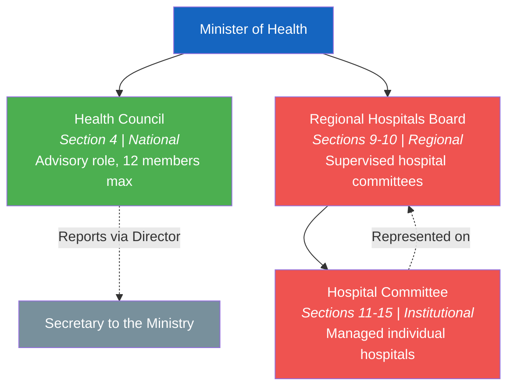
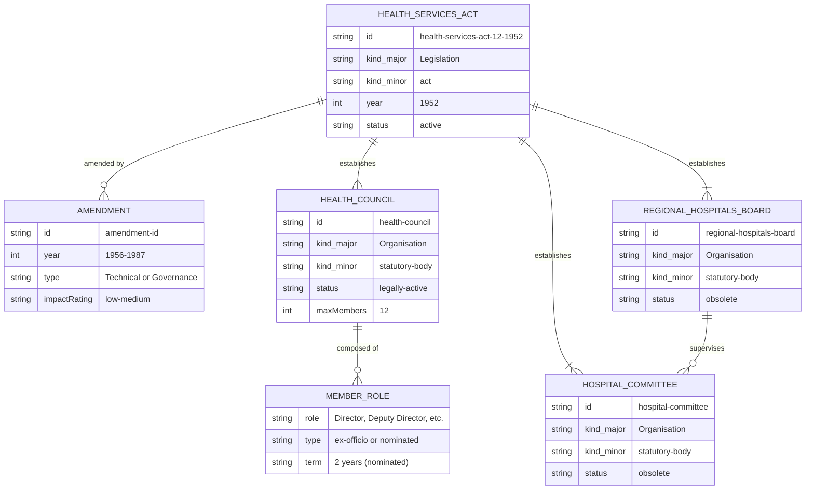

# Act Lineage & Relationships

Visual diagrams showing how the Health Services Act, No. 12 of 1952 evolved through amendments, how acts cross-reference each other, and how the original governance hierarchy was structured.

## Amendment Flowchart

The Health Services Act has been amended four times between 1956 and 1987. Two amendments were administrative (low impact), and two changed governance structure (medium impact).

**Legend:** Blue = low impact, Orange = medium impact, Red = external supersession

## Cross-Reference Network

Acts under the Health Ministry do not exist in isolation. Several acts reference or complement each other.

**Colors by domain:** Blue = Health Administration, Purple = Medical Regulation, Orange = Food & Drug Safety, Green = Hospital Management, Brown = Traditional Medicine

## Governance Hierarchy (Original 1952 Design)

The Health Services Act established a three-tier governance structure. The top tier (Health Council) remains legally active, while the lower two tiers were superseded by provincial devolution in 1989.

**Legend:** Green = legally active, Red = obsolete (superseded 1989), Gray = reporting target

## Entity-Relationship Diagram

This ER diagram shows the structural relationships between entities defined in the Health Services Act, modeled using OpenGIN-compatible entity types.

