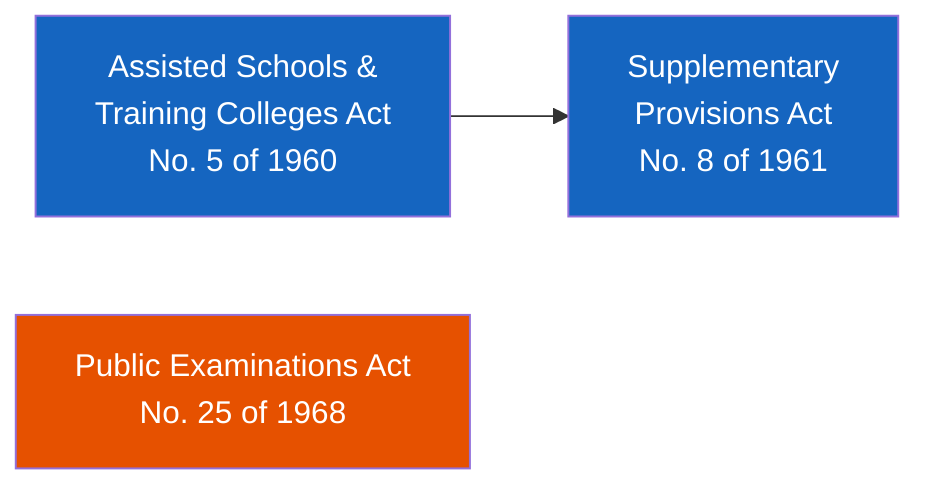

# Act Lineage — Education Ministry

This section maps the amendment history and cross-references between acts assigned to the Minister of Education.

## Cross-Reference Network

:::note
Two acts cataloged so far. The cross-reference network will grow as more Education acts are added (Education Ordinance, Universities Act, Pirivena Education Act, etc.).
:::

**Colors by domain:** Orange = Examination & Assessment, Blue = General Education, Purple = Higher Education, Green = Teacher Training, Teal = Technical & Vocational Education

## Act Sources

| Act | Number | Year | Source | Status |
|-----|--------|------|--------|--------|
| Assisted Schools & Training Colleges (Special Provisions) Act | No. 5 of 1960 | 1960 | [LawNet](https://www.lawnet.gov.lk/wp-content/uploads/Law%20Site/4-stats_1956_2006/set1/1960Y0V0C5A.html) | Available |
| Assisted Schools & Training Colleges (Supplementary Provisions) Act | No. 8 of 1961 | 1961 | [LawNet](https://www.lawnet.gov.lk/wp-content/uploads/Law%20Site/4-stats_1956_2006/set1/1961Y0V0C8A.html) | Available |
| Assisted Schools & Training Colleges (Amendment) Act | No. 65 of 1981 | 1981 | [LawNet](https://www.lawnet.gov.lk/wp-content/uploads/Law%20Site/4-stats_1956_2006/set3/1981Y0V0C65A.html) | Available |
| Public Examinations Act | No. 25 of 1968 | 1968 | [srilankalaw.lk](https://www.srilankalaw.lk/revised-statutes/volume-vi/965-public-examinations-act.html) | Partial (paywall) |
| Public Examinations (Amendment) Law | No. 15 of 1976 | 1976 | [lawlanka.com](https://www.lawlanka.com/lal_v2/actShortTitleView;jsessionid=20CD2E46288C5F4BF0394D1ACFC77EF4?selectedAct=1976Y0V0C15A) | Reference only |
