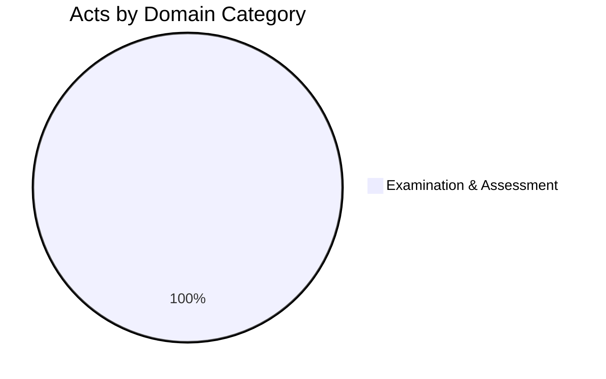

import MinistryOverview from '@site/src/components/MinistryOverview';
import ecosystemData from '@site/src/data/ministry-education-ecosystem.json';

# Education Ministry Legislative Ecosystem

The Minister of Education is responsible for legislation governing public examinations, general education administration, higher education, teacher training, and technical/vocational education in Sri Lanka.

:::info Gazette Reference
Assignment of subjects and functions per **Gazette Extraordinary No. 2289/43** dated July 22, 2022.
:::

## Domain Distribution

:::note Work in Progress
This is the first act cataloged for the Education Ministry. Additional acts (Education Ordinance, Universities Act, Pirivena Education Act, etc.) will be added progressively.
:::

## Acts Catalog

<MinistryOverview data={ecosystemData} />

## Key Observations

- The **Public Examinations Act (1968)** is the principal legislation governing O/L, A/L, and all government examinations
- The Act has only been amended once (1976) — a remarkably stable piece of legislation for nearly 60 years
- The **Commissioner-General of Examinations** holds significant discretionary power, including the ability to debar candidates for life
- Question papers are legally classified as **Secret Documents** — one of the strictest information security provisions in Sri Lankan legislation
