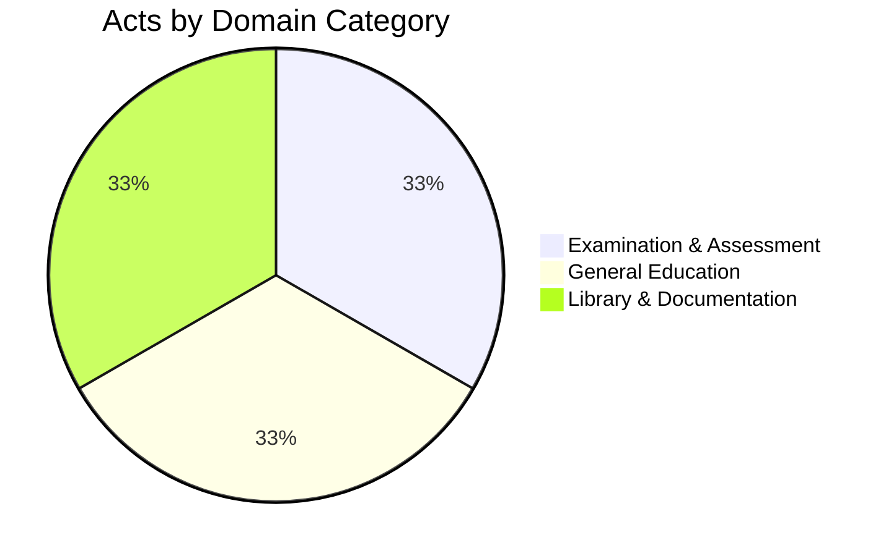

import MinistryOverview from '@site/src/components/MinistryOverview';
import ecosystemData from '@site/src/data/ministry-education-ecosystem.json';

# Education Ministry Legislative Ecosystem

The Minister of Education is responsible for legislation governing public examinations, general education administration, higher education, teacher training, and technical/vocational education in Sri Lanka.

:::info Gazette Reference
Assignment of subjects and functions per **Gazette Extraordinary No. 2289/43** dated July 22, 2022.
:::

## Domain Distribution

:::note Work in Progress
Three acts cataloged so far. Additional acts (Education Ordinance, Universities Act, Pirivena Education Act, etc.) will be added progressively.
:::

## Acts Catalog

<MinistryOverview data={ecosystemData} />

## Key Observations

- The **Public Examinations Act (1968)** is the principal legislation governing O/L, A/L, and all government examinations — amended only once in nearly 60 years
- The **Assisted Schools Act (1960)** drove the landmark nationalisation of ~2,500 denominational schools — one of the most significant government interventions in Sri Lankan education
- The **National Library Act (1998)** has never been amended in over 25 years — currently under SLLA review for its first major revision, citing missing objectives and no mandatory library professional representation on the Board
- The Assisted Schools legislation (1960 + 1961 Acts) is **currently under Law Commission review** for potential wholesale replacement by a proposed Education Standard Act
- Question papers are legally classified as **Secret Documents** under the Public Examinations Act — one of the strictest information security provisions in Sri Lankan legislation
